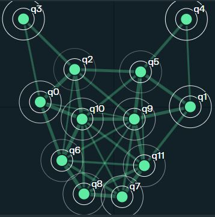
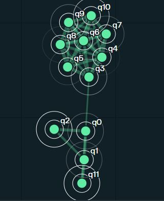
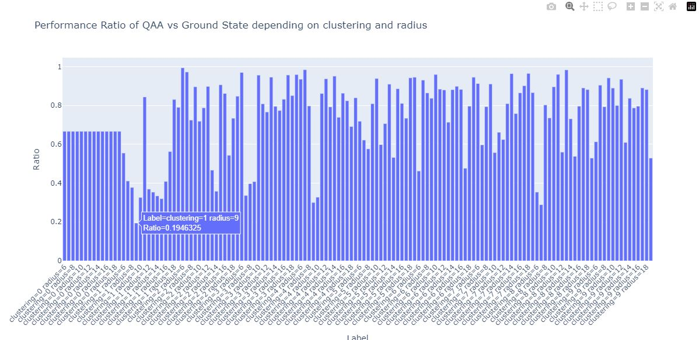

# Pasqal's Pulse 414 Challenge

Please look into the submission.ipynb notebook for the main summary of the work realised.

## Structure of this repo

The Archived_notebooks folder contains various notebooks that were created to rapidly test various feature of Pasqal's Pulser technology.

The export folder contains Various data that we generated during the Pulse 414 challenge

The .json files can be imported into pulser studio. 

- QAOA_submission1.json contains the optimized pulse sequence to find the ground state using QAOA in pulser. The atoms are Arranged like the pascal Triangle.

- QAA_submission1.json contains the pulse sequence to find the ground state using QAA of neutral atoms arranged like the pascal triangle

(Pascal triangle, image taken from https://jwilson.coe.uga.edu/EMAT6680Su12/Berryman/6690/BerrymanK-Pascals/BerrymanK-Pascals.html)

- Cat_QAA.json contains the pulse sequence to find the ground state using QAA of neutral atoms arranged like a cat

- flower_QAA.json contains the pulse sequence to find the ground state using QAA of neutral atoms arranged like a flower

Some prelimelarely work have been done to analyse the chaotic behavior of pasqal system.

