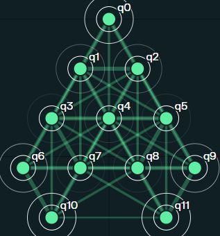
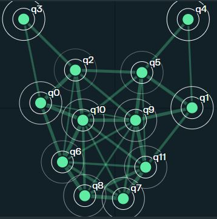
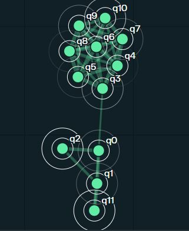
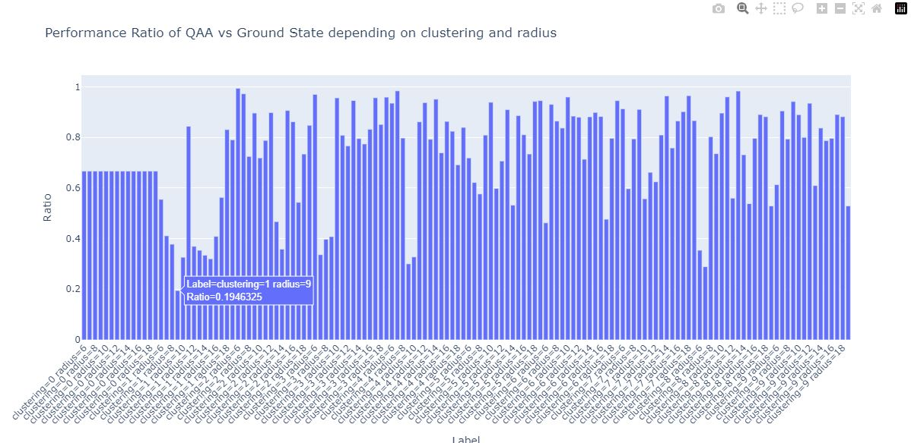

# Pasqal's Pulse 414 Challenge

Please refer to the `submission.ipynb` notebook for the main summary of the work completed.

**Interesting notes:**
- A function was created to generate a QUBO matrix from atom registers.
- Some preliminary work has been done to analyze the chaotic behavior (if any) of the Pasqal system.

## Structure of this Repository

The `Archived_notebooks` folder contains various notebooks used to rapidly test different features of Pasqal's Pulser technology.

The `export` folder contains various data generated during the Pulse 414 challenge.

The `.json` files can be imported into Pulser Studio:

- `QAOA_submission1.json` contains the optimized pulse sequence for finding the ground state using QAOA in Pulser. The atoms are arranged in the shape of a Pascal triangle.

- `QAA_submission1.json` contains the pulse sequence for finding the ground state using QAA with neutral atoms arranged in a Pascal triangle configuration.

  
*Pascal triangle image from [source](https://jwilson.coe.uga.edu/EMAT6680Su12/Berryman/6690/BerrymanK-Pascals/BerrymanK-Pascals.html)*

- `Cat_QAA.json` contains the pulse sequence for finding the ground state using QAA with neutral atoms arranged in the shape of a cat.

- `flower_QAA.json` contains the pulse sequence for finding the ground state using QAA with neutral atoms arranged in the shape of a flower.

Some preliminary work has been done to analyze the chaotic behavior (if any) of the Pasqal system:

